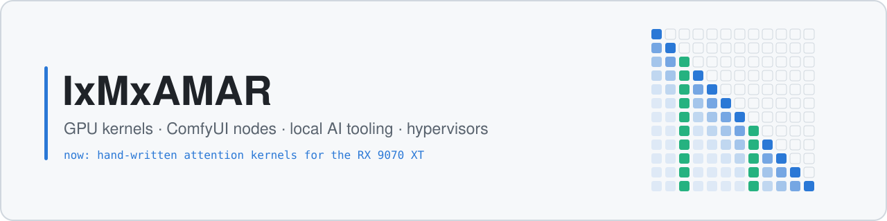

<picture>
  <source media="(prefers-color-scheme: dark)" srcset="assets/banner-dark.svg">
  
</picture>

# Hi, I'm IxMxAMAR

I like making generative models run faster, and run on hardware people actually own. That means
hand-written attention kernels for AMD's RX 9070 XT, ComfyUI node packs, one-click RunPod images
and tools for running LLMs locally. On the side I write hypervisors.

## ⚡ GPU and performance

| Project | What it is | |
|---|---|---|
| [SageAttention-RDNA4](https://github.com/IxMxAMAR/SageAttention-RDNA4) | SageAttention for the RX 9070 / 9070 XT, with hand-written HIP attention kernels for fp16 and bf16. Up to 2.3× faster than the existing gfx12 port, and a drop-in for ComfyUI. |  |

## 🧩 ComfyUI nodes

| Project | What it is | |
|---|---|---|
| [ComfyUI-Kling-Direct](https://github.com/IxMxAMAR/ComfyUI-Kling-Direct) | Kling video, image and audio generation inside ComfyUI, with your own API key. |  |
| [ComfyUI-NanoBanana2](https://github.com/IxMxAMAR/ComfyUI-NanoBanana2) | The full Gemini API as nodes: text, vision, image, audio, music, video and embeddings. |  |
| [ComfyUI-NanoBanana-FaceSwap](https://github.com/IxMxAMAR/ComfyUI-NanoBanana-FaceSwap) | Face and head replacement through Gemini image editing. |  |
| [ComfyUI-ElevenLabs-Pro](https://github.com/IxMxAMAR/ComfyUI-ElevenLabs-Pro) | ElevenLabs in ComfyUI: text-to-speech, speech-to-speech, sound effects, music and voice cloning. |  |
| [ComfyUI-API-Toolkit](https://github.com/IxMxAMAR/ComfyUI-API-Toolkit) | Kling, ElevenLabs and Gemini in one package: 68 nodes. |  |
| [ComfyUI-Utility-MegaPack](https://github.com/IxMxAMAR/ComfyUI-Utility-MegaPack) | 156 utility operations in 7 nodes, with 11 visual themes. |  |
| [ComfyUI-IxMxAMAR-Masterworks](https://github.com/IxMxAMAR/ComfyUI-IxMxAMAR-Masterworks) | 12 ready-made workflows that combine the packs above. |  |

## ☁️ Cloud and RunPod

| Project | What it is | |
|---|---|---|
| [ComfyUI-Ultimate](https://github.com/IxMxAMAR/ComfyUI-Ultimate) | A batteries-included ComfyUI image for RunPod: 29 curated node packs, SageAttention and FlashAttention, pinned dependencies, CI-gated builds. |  |
| [ComfyUI-Ultimate-ST](https://github.com/IxMxAMAR/ComfyUI-Ultimate-ST) | ComfyUI-Ultimate plus SillyTavern in one pod image. |  |
| [runpod-wan22-serverless](https://github.com/IxMxAMAR/runpod-wan22-serverless) | Serverless Wan 2.2 14B text-to-video and image-to-video endpoints, with a desktop client. |  |
| [ComfyUI-Serverless-FaceSwap](https://github.com/IxMxAMAR/ComfyUI-Serverless-FaceSwap) | ComfyUI face-swap workflows served as a RunPod API. |  |

## 🖥️ Local AI tooling

| Project | What it is | |
|---|---|---|
| [rigma](https://github.com/IxMxAMAR/rigma) | Hardware-aware local LLM deployment: `rigma up` probes your GPU and RAM and serves the best-tuned model setup for that exact machine. Community-verified setups live in [rigma-registry](https://github.com/IxMxAMAR/rigma-registry). |  |
| [raggity](https://github.com/IxMxAMAR/raggity) | Local-first search and Q&A over your notes, docs and PDFs: hybrid retrieval, reranking and verified citations, as a CLI or an API. |  |
| [LoRA-Dataset-Forge](https://github.com/IxMxAMAR/LoRA-Dataset-Forge) | Two photos in, a captioned, aspect-bucketed LoRA training set out, with a review step and one-click export. |  |

## 🛠️ Systems

| Project | What it is | |
|---|---|---|
| [Aria](https://github.com/IxMxAMAR/Aria) | A Type-1 hypervisor in C that boots through UEFI and virtualizes a running Windows in place, with a full nested VMX engine. |  |
| [Visor](https://github.com/IxMxAMAR/Visor) | A hypervisor experiment in Rust: UEFI loader plus Windows driver, VMCALL dispatch and EPT. |  |
| [barevisor](https://github.com/IxMxAMAR/barevisor) | Experiments on top of tandasat's barevisor (Rust). |  |
| [SimpleVisor](https://github.com/IxMxAMAR/SimpleVisor) | A modified SimpleVisor, ionescu007's minimal Intel VT-x hypervisor (C). |  |

## 📊 Stats

<picture>
  <source media="(prefers-color-scheme: dark)" srcset="https://github-readme-stats.vercel.app/api?username=IxMxAMAR&show_icons=true&hide_rank=true&hide_border=true&disable_animations=true&theme=github_dark&bg_color=0d1117">
  
</picture>
<picture>
  <source media="(prefers-color-scheme: dark)" srcset="https://github-readme-stats.vercel.app/api/top-langs/?username=IxMxAMAR&layout=compact&hide_border=true&disable_animations=true&theme=github_dark&bg_color=0d1117">
  
</picture>
